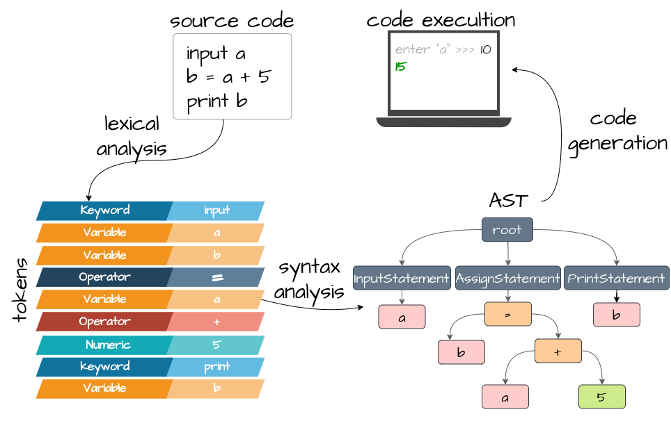

# Toy language



This is a simple toy language implementation. More details: [Building Your Own Programming Language From Scratch](https://hackernoon.com/building-your-own-programming-language-from-scratch)

### [Examples](src/test/resources)

## Syntax

### Basic constructions
1) Variables declaration
```
# plain types
<variable name> = <expression>

a1 = 123
a2 = "hello world"

# structure data type
<variable name> = new <structure name> [ <argument expression 1>, <argument expression 2>, ... ]

left_tree_node = new TreeNode [ 1 ]
right_tree_node = new TreeNode [ 2 ]
tree_node = new TreeNode [ 3, left_tree_node, right_tree_node ]
tree_node = new TreeNode [ 3, new TreeNode [ 1 ], null ]

# array
<array> = { <value1>, <value2>, ... }
example_array = { 1, 2, "three", new TreeNode [ 4 ] }
empty_array = {}
```
2) Conditions
```
if <condition> then
    # statements
elif <condition> then
    # statements
else then
    # statements
end

if a1 > 5 and tree_node :: value == 3 then
    # statements
elif a2 == "hello" or a3 == "world" then
    # statements
else then
    # statements
end  
```
3) Print to console
```
print <expression>
print a1 + a2 + tree_node :: value
```
4) Input from console
```
input <variable name>
input number
```
5) Functions
```
fun <function name> [ <argument1, argument2>, ... ]
    <body>
    return <expression>
end

fun fibonacci_number [ n ]
    if n < 2 then
        return n
    end
    return fibonacci_number [ n - 1 ] + fibonacci_number [ n - 2 ]
end
```
6) Loops
```
# For loop
loop <variable> in <lower_bound>..<upper_bound>
    # statements
end

# Specify the step
loop <variable> in <lower_bound>..<upper_bound> by <step>
    # statements
    # seed increment statement
end

# While loop
loop <condition>
    # statements
end

# Iterable loop (for-each)
loop <variable> in <iterable>
    # statements
end

# terminate the loop
loop <variable> in <lower_bound>..<upper_bound> by <step>
    if <other_condition> then
        break
    end
end

# jump to the next iteration
loop <variable> in <lower_bound>..<upper_bound> by <step>
    if <other_condition> then
        next
    end
end
```

### Data types
There are the following data types currently supported:
1) Numeric
```
number1 = 1
number2 = 2.
number3 = 3.21
number4 = 0.432
number5 = .543
number6 = -1
```
2) Text
```
text = "hello world"
```
3) Logical
```
logical1 = true
logical2 = false
```
4) Structure. It's just a wrapper for multiple data types
```
struct <struct name> [ <struct arg name1>, <struct arg name2>, ...  ]

struct TreeNode [ value, left, right ]
tree = new TreeNode [ 3, null, new TreeNode [ 5 ] ]

# get a structure's value
tree_value = tree :: value
tree_left_node = tree :: left
tree_right_node = tree :: right

# set a structure's value
tree :: value = tree_value + 1
tree :: left = new TreeNode [ 5 ]
tree :: right = new TreeNode [ tree :: right :: value + 1 ]
```
5) Arrays
```
<array> = { <value1>, <value2>, ... }
example_array = { 1, 2, "three", new TreeNode [ 4 ] }
empty_array = {}

# get an array's value
<value> = <array> { <index> }
value = items{1}

# set an array's value
<array> { <index> } = <value>
items{1} = 123

# append a value to array
<array> << <value>
items = {1,2}
items << 3  #{1,2,3}
```

6) Null
```
value = null
```

### Operators
To calculate a complex expression in the proper order, each of the supported operators has its own precedence:

| Operator               | Value     | Precedence | Example                      |
|------------------------|-----------|------------|------------------------------|
| Assignment             | ```=```   | 1          | ```a = 5```                  |
| Append value to array  | ```<<```  | 1          | ```array << "value"```       |
| Logical OR             | ```or```  | 2          | ```true or false```          |
| Logical AND            | ```and``` | 3          | ```true and true```          |
| Left Paren             | ```(```   | 4          |                              |
| Right Paren            | ```)```   | 4          |                              |
| Equals                 | ```==```  | 5          | ```a == 5```                 |
| Not Equals             | ```!=```  | 5          | ```a != 5```                 |
| Greater Than Or Equals | ```>=```  | 5          | ```a >= 5```                 |
| Greater Than           | ```>```   | 5          | ```a > 5```                  |
| Less Than Or Equals    | ```<=```  | 5          | ```a <= 5```                 |
| Less Than              | ```<```   | 5          | ```a < 5```                  |
| Addition               | ```+```   | 6          | ```a + 5```                  |
| Subtraction            | ```-```   | 6          | ```a - 5```                  |
| Multiplication         | ```*```   | 7          | ```a * 5```                  |
| Division               | ```/```   | 7          | ```a / 5```                  |
| Floor Division         | ```//```  | 7          | ```a // 5```                 |
| Modulo                 | ```%```   | 7          | ```a % 5```                  |
| NOT                    | ```!```   | 8          | ```!false```                 |
| Structure Instance     | ```new``` | 8          | ```a = new TreeNode [ 5 ]``` |
| Structure Value        | ```::```  | 8          | ```b = a :: value```         |
